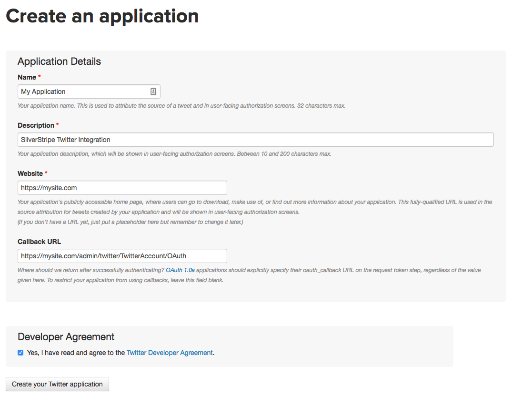

# Documentation

## Installation

`composer require somardesignstudios/silverstripe-twitter`

## Configuration

### Twitter

First you need to register a [Twitter application](https://apps.twitter.com/). This application acts as proxy between
your site and the Twitter API.

Fill in the registration for as shown bellow.



Take note of the "Consumer Key" and "Consumer Secret" values under the "Keys and Access Tokens" tab.

### SilverStripe

Add your "Consumer Key" and "Consumer Secret" values to config.

__mysite/config/config.yml__

```
TwitterService:
  consumer_key: 'YOUR_CONSUMER_KEY'
  consumer_secret: 'YOUR_CONSUMER_SECRET'
```

You can optionally override the callback URL if required.

```
TwitterService:
  oauth_callback: 'admin/twitter/TwitterAccount/OAuth'
```

Run a `dev/build?flush=1` and everything should be ready to go.

## Usage

Once you have created and authenticated a twitter account via the CMS you're ready to make API requests.

The below example shows how you could display a list of Tweets on a page.

__TwitterPage.php__

```
class TwitterPage extends Page
{
    private static $has_one = [
        'TwitterAccount' => 'TwitterAccount',
    ];

    public function getCMSFields()
    {
        $fields = parent::getCMSFields();

        $fields->addFieldToTab(
            'Root.Main',
            DropdownField::create(
                'TwitterAccountID',
                'Twitter account',
                TwitterAccount::get()->map('ID', 'Title')
            )
            ->setEmptyString('Please select...')
        );

        return $fields;
    }
}

class TwitterPage_Controller extends Page_Controller
{
    public static $dependencies = [
        'twitterService' => '%$TwitterService',
    ];

    /**
     * @var TwitterService
     */
    public $twitterService;

    /**
     * Get a list of tweets for the page's TwitterAccount.
     *
     * @return array
     */
    public function getTweets()
    {
        $tweets = [];

        $twitterAccount = $this->TwitterAccount();

        if (!$twitterAccount || !$twitterAccount->isAuthorised()) {
            return $tweets;
        }

        $token = $twitterAccount->getAccessToken();

        $client = $this->twitterService->getClient($token['oauth_token'], $token['oauth_token_secret']);

        $response = $client->get(
            'statuses/user_timeline',
            [
                'screen_name' => $token['screen_name'],
                'count' => 10,
            ]
        );

        if ($client->getLastHttpCode() === 200) {
            $tweets = $response;
        } else {
            user_error("Failed to fetch tweets for user {$twitterAccount->Title}", E_USER_WARNING);
        }

        return $tweets;
    }
}
```

Things to consider with the above example:

* Use a [DataExtension](https://docs.silverstripe.org/en/3/developer_guides/extending/extensions/) so the functionality
can be applied across multiple page types.
* Use [SS_Cache](https://docs.silverstripe.org/en/3/developer_guides/performance/caching/) to improve performance
and avoid API rate limits.

For more information around the client API see the [abraham/twitteroauth](https://github.com/abraham/twitteroauth)
documentation.
